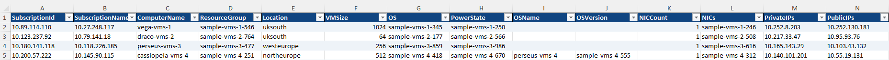
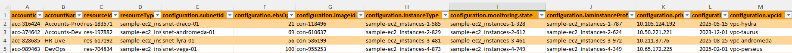

# CloudState™ Showcase

Welcome to the **CloudState™ Showcase Repository**.

This repository provides a high-level, non-sensitive demonstration of **CloudState™**, a multi-cloud inventory, insights, and governance toolkit developed by **CygnusTech Ltd**.

The purpose of this showcase is to illustrate what CloudState™ produces using synthetic, de-identified data and representative artefacts—without exposing any private source code or customer information.

---

## 📁 Included in This Repository

All synthetic example artefacts are provided inside the [`examples/`](./examples) directory.

---

### **1. Synthetic Azure Inventory Example**

**Download full workbook (XLSX):**  
➡️ [CloudState_Azure_DEMO.xlsx](./examples/CloudState_Azure_DEMO.xlsx)

**Quick Preview:**  

  

This report demonstrates how CloudState™ structures Azure resource data, including:

- Virtual machine inventory  
- Tag compliance  
- Orphaned resource detection  
- Cost hygiene indicators  
- Subscription-level summaries  

---

### **2. Synthetic AWS Inventory Example**

**Download full workbook (XLSX):**  
➡️ [CloudState_AWS_DEMO.xlsx](./examples/CloudState_AWS_DEMO.xlsx)

**Quick Preview:**  

  

This report demonstrates how CloudState™ structures AWS resource data, including:

- EC2 instance insights  
- Tagging status  
- EBS/S3/VPC hygiene signals  
- Orphan detection  
- Environment-wide overview pages  

These screenshots and datasets are entirely synthetic and contain no real cloud data.

---

## 🧭 What CloudState™ Does

**CloudState™** is a multi-cloud insight engine designed to give organisations unified visibility across Azure, AWS, and hybrid/on-premise estates.

It focuses on:

- Comprehensive inventory across cloud subscriptions/accounts  
- Tag intelligence and governance hygiene  
- Orphaned resource detection  
- Cost-related signals for FinOps and operational review  
- Automated Excel/CSV outputs suitable for audits and monthly service reporting  
- Integration with containerised GitHub Actions workflows for fully automated runs  

---

## 🔒 What Is Not Included

To protect intellectual property and customer confidentiality:

- The full **CloudState™** source code is *not* included.  
- No internal CygnusTech implementation logic is provided.  
- All datasets are entirely synthetic.  

---

## 🎯 Purpose of This Showcase

This repository exists to help partners, clients, and reviewers understand:

- What CloudState™ reports look like  
- The breadth and depth of the generated insights  
- How CloudState™ structures multi-cloud inventory data  
- The value CloudState™ adds in governance, visibility, and cost hygiene  

It is intended for demonstrations, pre-sales conversations, and architectural overviews.

---

## 📝 Trademark Notice

**CloudState™** is a trademark of CygnusTech Ltd.  
All rights reserved.

---

For demonstrations, licensing discussions, or technical deep-dives, please contact **CygnusTech Ltd**.
